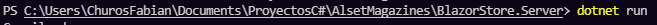
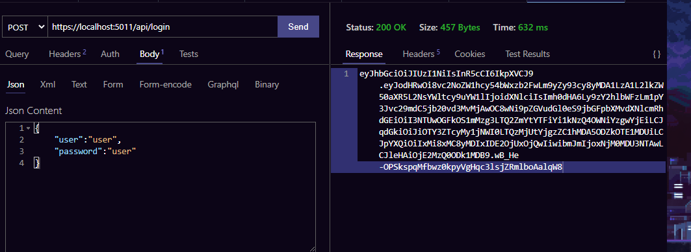
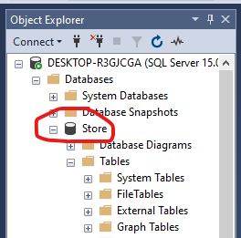
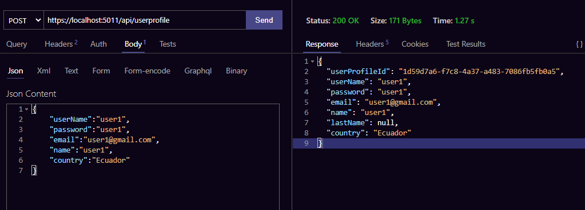
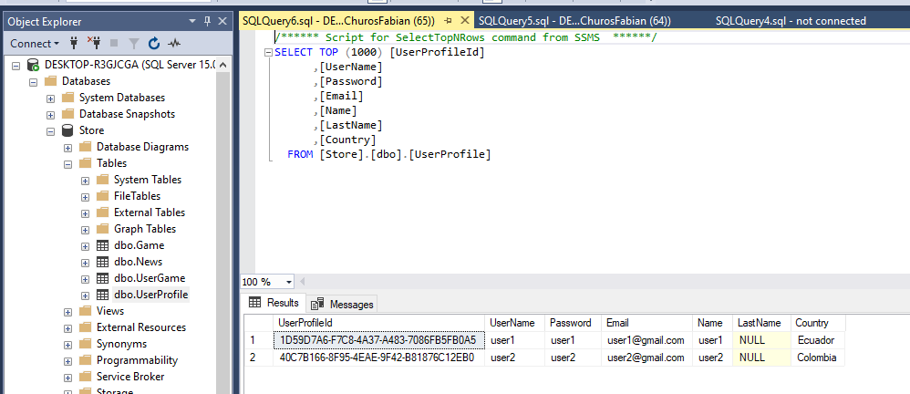

# Alset Magazine subscription
**This project is made with Blazer and .NET Core MVC**
It is a project that was finished in 24 hours and there are a few additional things missing. The time limit to develop it was 48 hours, but hey, it is interesting to take on the challenge in less time.
---

---
Once the project is downloaded, the following steps must be performed:
---
## Step 1 Installation
1. Install ASP .NET CORE
2. Use Postman or a tool to run the API
3. SQL Server

## Step 2 Initialize the Back-End and Front-End of the application

Move to the folder BlazorStore.Client and run dotnet run in this way the Fron-End will be executed as shown in the following image:

Move to the Blazor Store.Server folder and run dotnet run in this way the Banck-End will be executed as shown in the following image:

Both must be kept running for the Back-End and Fron-End to work.
## Step 3 Create User

There is a default user in the project which can be accessed in the following way:
You must send a POST to activate the authentication by JASON WEB TOKEN in this way

and then you can enter with these credentials

1. username: user
2. password: user

This user is only a test user but below I will show how to create another test user but from the database:

### First

We create a database with the name Store

### Second

Run the endpoint to add new users
---

---

---
You can see that thanks to the use of Entity Framework the necessary tables will be created automatically and in turn you will also see that the users that you wrote will be added

